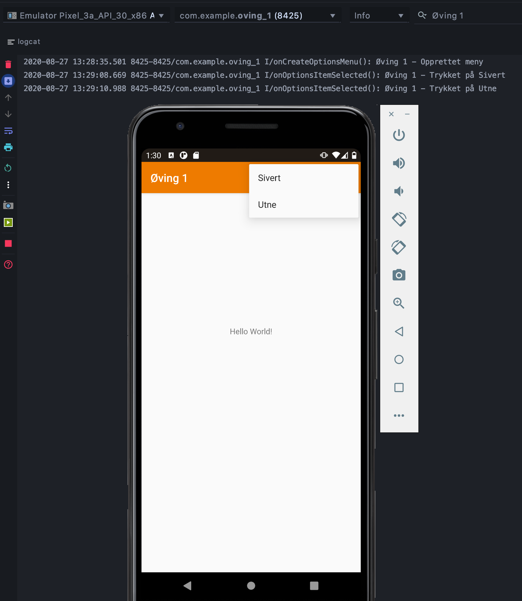

# Introduction and Installation
This assignment is meant to simply make sure the software works, as well as give a brief introduction to programming in android. the assignment was to install Android Studio, and create a simple app with a menu containing my name, while printing what is happening to the console.
## Result
 
