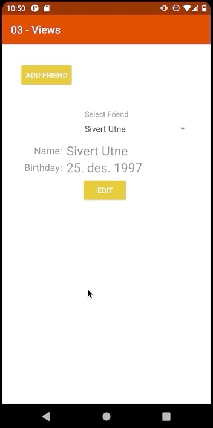

# Views
This assignment dealt with different ways to represent infomration on the screen, more specifically we were asked to use several different layouts and components, one of which had to use an adapter. In my assignemnt i have used the following:
 - Spinner Component with adapter for selection
 - TableLayout for displaying infomration about each friend (also using TableRow)
 - GridLayout for input fields
 - LinearLayout for the cancel/confirm buttons
 - TextView, EditText and Button components

 ## Results
 ### Selecting a friend
 

 ### Editing a friend
 

 ### Adding a new friend
  
