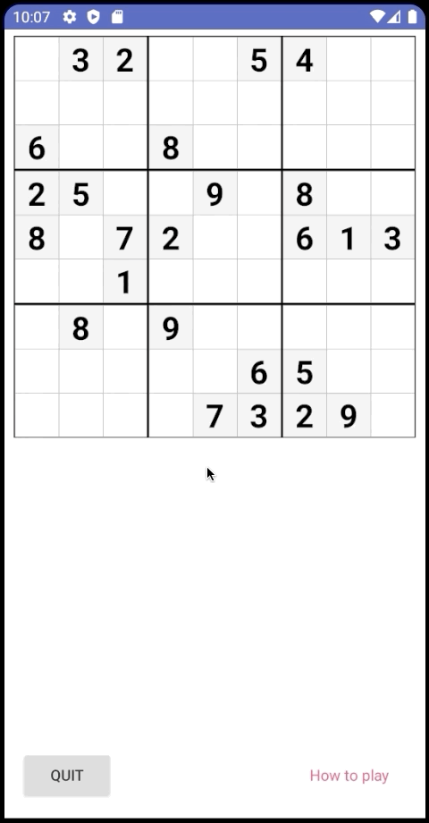

# Sudoku App
## Final project in Application development for Android
Create a Sudoku-app. Go to http://www.matematikk.org/sudoku/ for rules and examples.

The app will have at least two parts, one where you can retrieve a sudoku-board and solve it, and another where you can add a Sudoku-board to storage.
The boards must be classified as either Easy, Medium or Hard, and the player should be able to choose a category and get a random board within this category to solve.

In the simplest version the storage of the boards can be on the device itself, but if you want an extra challenge, you can try to set up a server that for the app to communicate to. If you choose to do this make sure the it's possible for the one examining the project to test the app themselves.

The app must have, at a minimum, the following functionality:
- Possibility to retrieve a board within a specific category. You must therefore create at least one board for each category.
- The possibility to add a new board in a category
- The user must be able to select a cell and insert a value
- It must be possible to change the values of the numbers added by the user.
- A functionality to mark a cell as *unsure*, if the user suspects the value might be wrong
- Feedback when all the cells are filled of wether the solution is correct or not.
- The user can select their language, either Norwegian or English.
- short instructions on how to play.

# Demonstration
### Language selection

### Starting a new game

### View instructions of how to play

### Adding and altering values on the board

### Marking a cell as *unsure*

### Feedback when player is done

### Saving and returning to a game later

### Adding a new board

